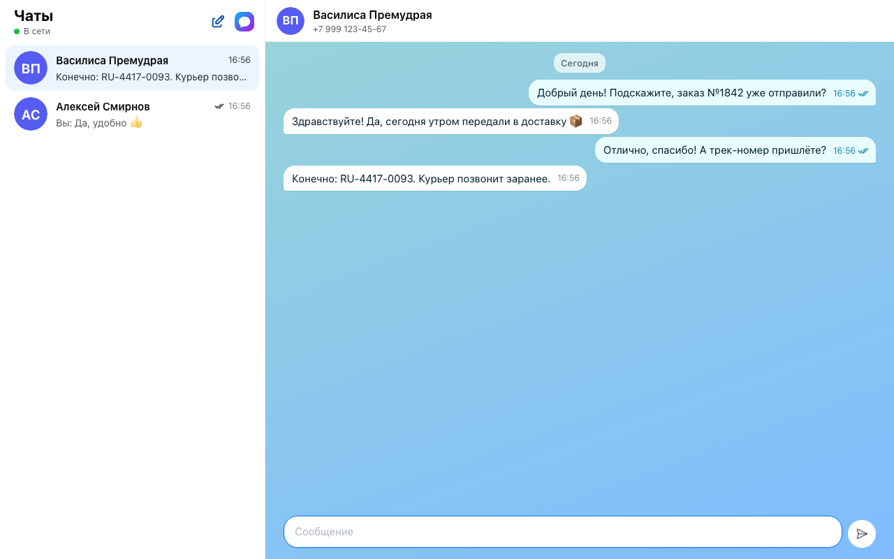
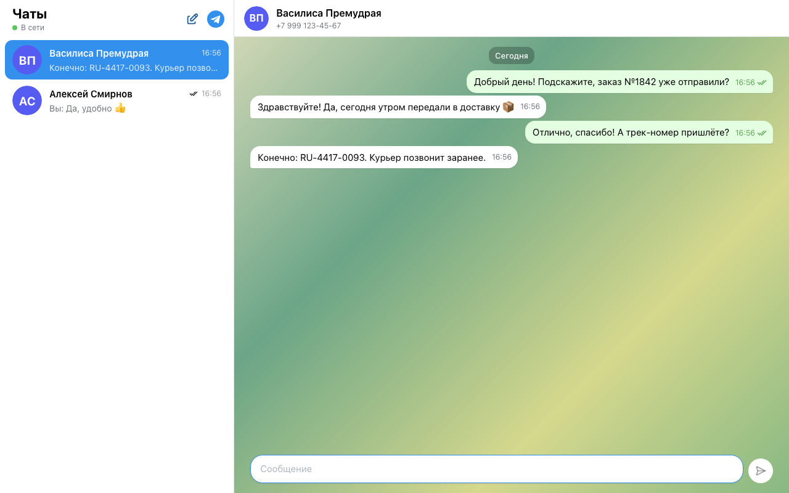
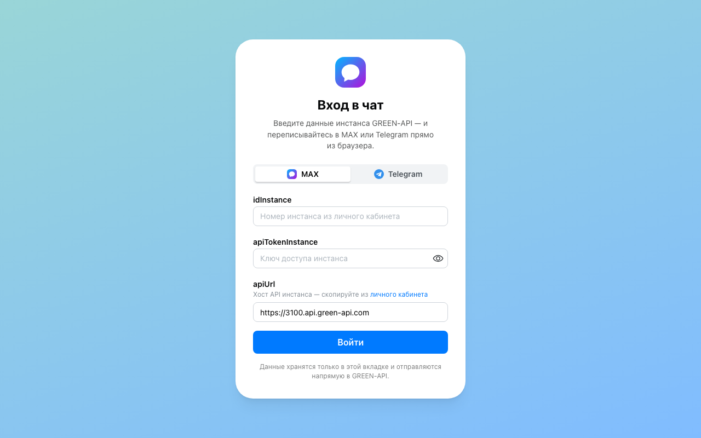
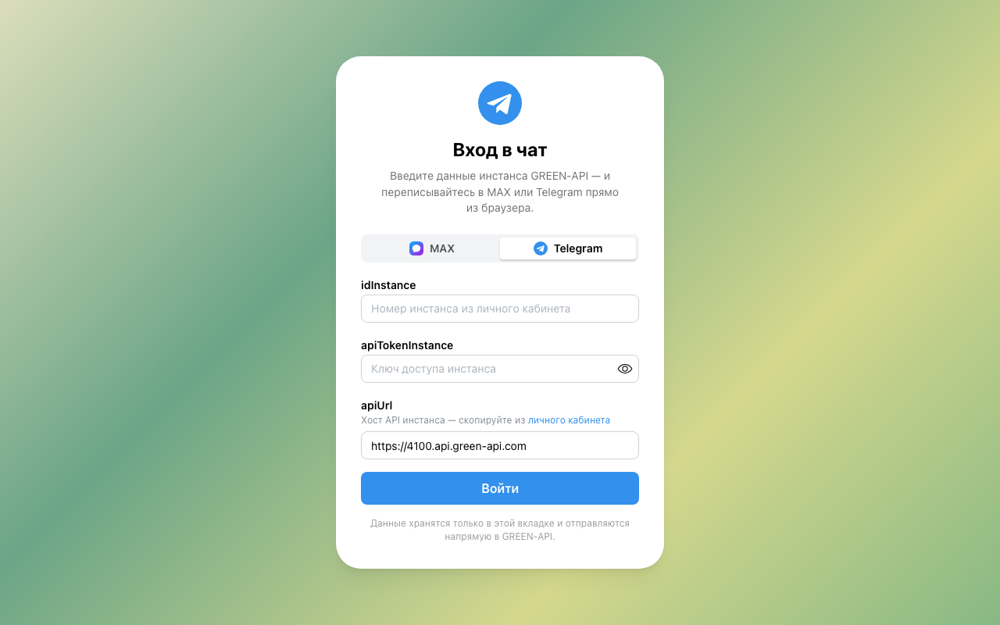
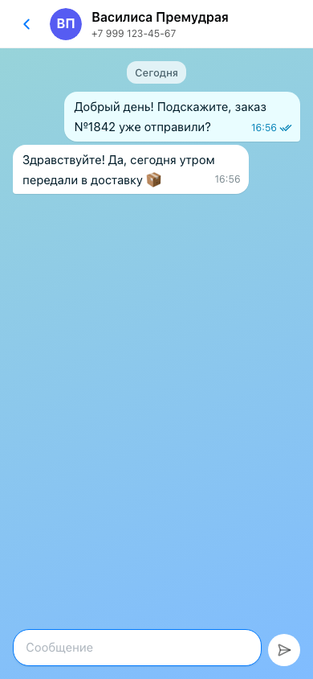

# GREEN-API Chat — MAX и Telegram

Веб-чат для отправки и получения текстовых сообщений в **MAX** и **Telegram** через
[GREEN-API](https://green-api.com/max). Тестовое задание «Фронтенд-разработчик React».

**Демо** будет опубликовано на отдельном домене; до этого — [локальный запуск](#быстрый-старт) за три команды.

|         MAX (прототип — web.max.ru)         |               Telegram (вторая версия)                |
| :-----------------------------------------: | :---------------------------------------------------: |
|        |        |
|  |  |

Скриншоты сняты на демо-данных: e2e-фейк GREEN-API, вымышленные имена и номера.

<details>
<summary>Телефон</summary>



</details>

## Что умеет

Сценарий из ТЗ целиком:

1. **Вход** по `idInstance` и `apiTokenInstance` (+ `apiUrl` из личного кабинета). Данные проверяются
   методом `getStateInstance`. Неверный токен или неавторизованный инстанс объясняются прямо в форме.
2. **Новый чат по номеру телефона.** Номер превращается в `chatId` методом `CheckAccount`, поэтому
   ответ собеседника попадает в тот же чат. В Telegram можно искать и по `@username`.
3. **Отправка текста** методом `SendMessage`. Enter — отправить, Shift+Enter — перенос строки, лимит
   длины по мессенджеру (MAX — 4000, Telegram — 4096).
4. **Получение ответа** по технологии HTTP API: `ReceiveNotification` → обработка → `DeleteNotification`.

И то, без чего чат неудобен:

- статусы исходящих: отправляется → отправлено → доставлено → прочитано, или «не отправлено» с кнопкой «Повторить»;
- входящее от нового человека само создаёт чат; счётчик непрочитанных, сортировка по последнему сообщению;
- диагностика инстанса: не авторизован, задан `webhookUrl` (тогда HTTP API не отдаёт входящие),
  выключены уведомления, исчерпан лимит тарифа;
- история сохраняется при перезагрузке (у каждого инстанса своя); вкладки не делят очередь уведомлений;
- мобильная раскладка; темы MAX и Telegram с цветами, снятыми с их веб-версий.

Только текст, как требует ТЗ: фото, стикеры и прочее показываются заглушкой «не поддерживается».

## Быстрый старт

Нужны **Node.js 22.22.2+** (лучше последний 22.x) и **pnpm 12** (версия закреплена в `package.json`, проще всего через corepack).

```bash
corepack enable
```

```bash
pnpm install
```

```bash
pnpm dev
```

Откройте http://localhost:5173, выберите мессенджер и введите данные инстанса.

### Где взять данные инстанса

1. Зарегистрируйтесь в [личном кабинете GREEN-API](https://console.green-api.com) и создайте инстанс
   (тариф «Разработчик» бесплатный).
2. Авторизуйте его: QR-код в кабинете сканируется в приложении мессенджера
   (MAX: Профиль → Устройства → Войти по QR-коду; Telegram: Настройки → Устройства → Подключить устройство).
3. Скопируйте `idInstance`, `apiTokenInstance` и `apiUrl`.
4. В настройках инстанса оставьте **пустым** URL для уведомлений (`webhookUrl`) и включите уведомления
   о входящих сообщениях и о статусах отправленных. Без этого HTTP API не отдаёт входящие —
   приложение подскажет баннером.

## Скрипты

| Команда                            | Что делает                                                             |
| ---------------------------------- | ---------------------------------------------------------------------- |
| `pnpm dev`                         | dev-сервер на :5173                                                    |
| `pnpm build` / `pnpm preview`      | продакшен-сборка (со строгим CSP) и её предпросмотр                    |
| `pnpm test` / `pnpm test:coverage` | юнит- и компонентные тесты (Vitest), покрытие с порогами 90/85 %       |
| `pnpm e2e:install` / `pnpm e2e`    | установить Chromium для Playwright / e2e на прод-сборке                |
| `pnpm e2e:screenshots`             | пересобрать скриншоты для README                                       |
| `pnpm verify`                      | всё, что проверяет CI: типы, линтер, формат, тесты с покрытием, сборка |

## Как устроено

React 19 + TypeScript (strict), Mantine 9 + CSS Modules, TanStack Router и Query, Zod, zustand.
Архитектура — Feature-Sliced Design: `app → pages → widgets → units (session, chat, notification) → shared`,
границы слоёв проверяет ESLint.

Своего бэкенда нет: CORS GREEN-API открыт, браузер вызывает API напрямую. Получение — long polling
с удалением уведомления **после** обработки (ничего не теряется), экспоненциальной паузой при сбоях
и одной опрашивающей вкладкой на инстанс (Web Locks).

Подробно — в [документации](docs/README.md): [PRD](docs/product/prd.md),
[архитектура](docs/architecture/overview.md), [6 ADR](docs/architecture/adr/),
[контракт GREEN-API](docs/api/green-api.md), [эпики и истории](epics/README.md).

## Качество

- **454** юнит-, компонентных и интеграционных теста (Vitest + Testing Library + MSW), покрытие строк ~99 %, веток ~95 %.
- **9** e2e-сценариев (Playwright) на продакшен-сборке: сценарий ТЗ для MAX и Telegram, новый собеседник,
  `@username`, неизвестный номер, неверный токен, перезагрузка и выход, две вкладки с разными мессенджерами, телефон.
  GREEN-API в e2e заменён фейком, который ведёт себя по документации (очередь до `DeleteNotification`).
- CI на push в `main` и на каждый PR: типы, линтер, формат, тесты с порогами покрытия, сборка, e2e.

## Безопасность

- Токен — только в `sessionStorage` вкладки и никогда в HTTP-кеше (`cache: 'no-store'`: GREEN-API
  не присылает `Cache-Control`, а токен — часть URL).
- «Выйти» стирает токен и историю этого инстанса на устройстве и выводит из него другие вкладки.
  Если токен перестал работать (сменили в кабинете), удаляется только токен — переписка останется.
- `apiUrl` принимается только с поддоменов `green-api.com` / `greenapi.com` и перепроверяется при
  чтении сессии — токен нельзя направить на чужой адрес. Токен кодируется в пути запроса.
- Продакшен-CSP: скрипты только свои, сетевые запросы только к хостам GREEN-API. CSP снижает риск
  внедрения скрипта; главная защита — отсутствие HTML из данных (текст сообщений выводится как текст).
- История — свой ключ `localStorage` на инстанс, разбор Zod-схемой по записям, защита от
  переполнения квоты.
- Зависимости: pnpm с `minimumReleaseAge` 7 дней и запретом install-скриптов, `pnpm audit` — 0
  уязвимостей; GitHub Actions закреплены по SHA, раннеры — по версии, Dependabot с той же недельной
  выдержкой и отдельным PR на каждый мажор.
- Публиковать — только на отдельном домене: общий origin вроде `*.github.io` делит хранилище с
  чужими сайтами. Подробно — [ADR-0004](docs/architecture/adr/0004-credentials-and-history-storage.md).

## Ограничения

- Оба мессенджера проверены e2e-тестами с фейком GREEN-API, который ведёт себя по документации
  (форматы ответов и уведомлений взяты из неё). Живой прогон на реальном инстансе ещё не выполнен.
- Только личные чаты и только текст — по ТЗ. Группы и медиа вне скоупа.
- Токен находится в браузере (так задумано ТЗ: пользователь вводит его на сайте). Полностью убрать его
  оттуда можно только своим бэкендом-прокси — см. [roadmap](docs/product/roadmap.md).
- Осознанно не сделано, с обоснованием в ADR:
  - после возврата сети приём продолжается по окончании текущей паузы, это до 36 с;
  - вкладка, у которой приём остановился с фатальной ошибкой, держит замок опроса, пока не нажать
    «Повторить» ([ADR-0003](docs/architecture/adr/0003-http-api-long-polling.md));
  - слияние истории между вкладками не умеет удалять, поэтому перенесённый на новый `chatId` чат
    может вернуться из второй вкладки;
  - у хранилища нет функции миграции;
  - вкладка, открытая во время чужой отправки, может показать её «не отправлено» до ответа сервера;
  - истории других инстансов не вытесняются при переполнении
    ([ADR-0004](docs/architecture/adr/0004-credentials-and-history-storage.md));
  - вендорные чанки не выделены;
  - текст неожиданной (не GREEN-API) ошибки показывается как есть
    ([ADR-0006](docs/architecture/adr/0006-stack-and-supply-chain.md)).
