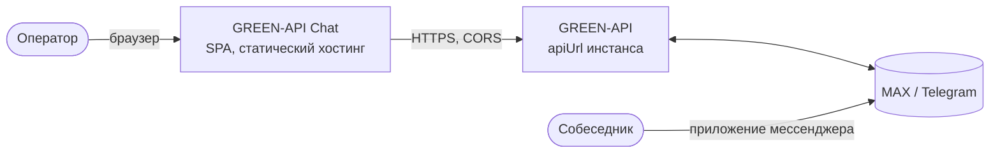
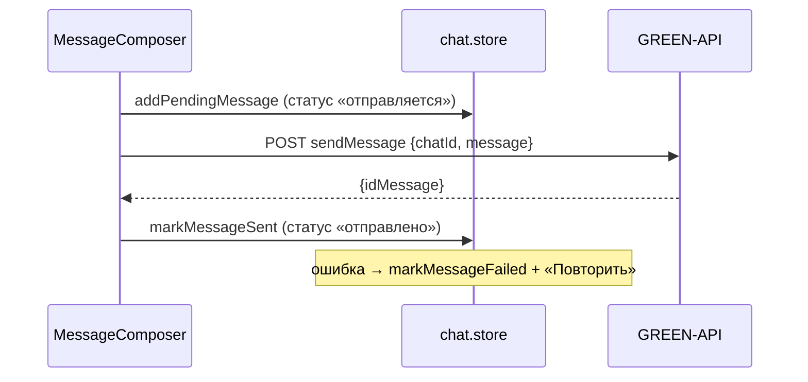
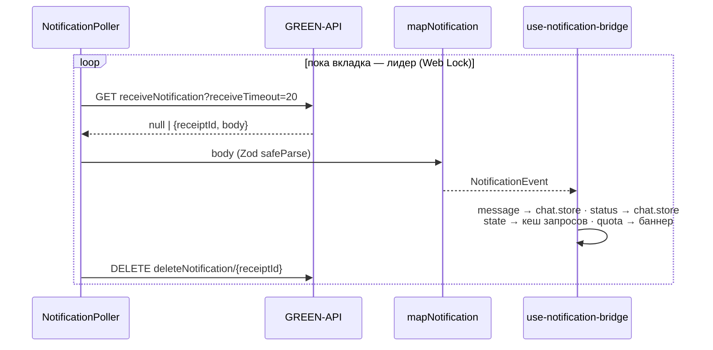

# Обзор архитектуры (C4-lite)

## Контекст



Своего сервера нет: браузер вызывает GREEN-API напрямую (ADR-0001). Инстанс GREEN-API связан
с аккаунтом мессенджера владельца; собеседник пишет из обычного приложения MAX или Telegram.

## Слои кода (FSD «units»)

```
src/
  app/        провайдеры, тема, QueryClient, роутер, маршруты (тонкие: guard + компонент страницы)
  pages/      login · chats (layout + мост уведомлений + выход) · fallback (404, ошибка)
  widgets/    chat-sidebar (шапка, список, «Новый чат») · chat-window (шапка, лента, поле ввода)
  units/
    session/       вход, сессия, диагностика инстанса, меню аккаунта
    chat/          история чатов (zustand + localStorage, свой ключ на инстанс), создание чата, отправка, UI ленты
    notification/  long polling, разбор уведомлений, один опрашивающий на инстанс, индикатор
  shared/
    api/      клиент GREEN-API (6 методов), ошибки, Zod-схемы ответов
    config/   различия MAX и Telegram
    lib/      телефон, даты, ключи запросов, тексты ошибок
    ui/ hooks/ test/
```

Зависимости только вниз; юниты не импортируют друг друга. Склейка юнитов — в `pages/chats`
(хук `use-notification-bridge`) и в виджетах. Границы проверяет ESLint.

## Поток отправки



## Поток получения



Ошибки сети, 5xx и 429 — пауза 1 → 30 с и повтор; 401/403 — выход с сохранением истории;
`webhookUrl` задан, инстанс истёк или `apiUrl` неверен (404) —
остановка с объяснением (ADR-0003).

## Ключевые решения

| ADR                                                 | Решение                                                              |
| --------------------------------------------------- | -------------------------------------------------------------------- |
| [0001](adr/0001-client-only-direct-green-api.md)    | SPA без бэкенда, прямые вызовы GREEN-API (CORS проверен)             |
| [0002](adr/0002-two-messengers-one-codebase.md)     | MAX и Telegram в одной кодовой базе                                  |
| [0003](adr/0003-http-api-long-polling.md)           | Long polling, удаление после обработки, один опрашивающий на инстанс |
| [0004](adr/0004-credentials-and-history-storage.md) | Токен — sessionStorage, история — localStorage, CSP                  |
| [0005](adr/0005-chat-id-via-check-account.md)       | Чат по `chatId` из `CheckAccount`                                    |
| [0006](adr/0006-stack-and-supply-chain.md)          | Стек и защита цепочки поставок                                       |
